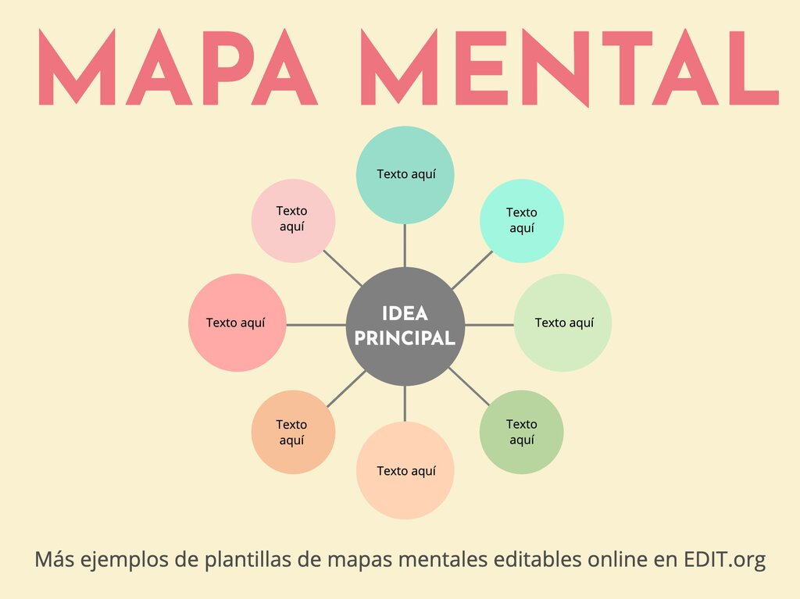

# Rascunho do Produto e seu Product Backlog

## Rascunho do produto

- Página inicial com um sumário interativo semelhante a esse.
- Páginas com conteúdos que explica Metodologia Ágil com Scrum
- Breadcrumbs e botões **próximo** e **anterior** para navegação no conteúdo
- Após cada seção de conteúdo, ter uma seção **Em Resumo** que sintetiza os conceitos apreendidos nessa seção. E ter uma seção **Na Prática** onde haverá um Exemplo Prático, ou seja, um caso numa empresa e um passo-a-passo de como aplicar o que foi aprendido nesse caso.
- Ter uma seção para o **Quiz** que irá validar o conhecimento adquirido pelo usuário
- Exames no final de todo o contéudo onde tirando a nota mínima, a pessoa receberá o badge
- Mascote para o nosso curso:
  - Com esse mascote nós podemos conversar com os usuários em um tom de formá-los em mula
  - Podemos implementar conceitos de gamificação onde nossos usuários irão  ganhar títulos/badges ao terminar certas seções do curso. Por exemplo, ao terminar o Cap 1 ele ganha um título/badge **Mula Noobie**. Ao teeminr todo o curso ele ganha o título de **Mula Buster** (remetendo a Bug Busters). Isso vai mostrar inclusive que nós pensamos na jornada do usuário tanto falado em UX.
    - Ao começar a ler a introdução o usuário irá ganhar um badge Jornada da Mula Ágil por ter começado a sua jornada Agile
    - Na Introdução da página principal, na seção que explica do que se trata esse site, podemos brincar dizendo que somos uma Academia de Scrum para Mulas onde temos o objetivo de transformá-las em experiente Scrum Busters (brincando com o nosso nome e os papéis de Scrum como Scrum Team, Scrum Master)
    - E usamos um método chamado Mule-Driven Development (MDD) no ensino das técnicas avançadas de Scrum, uma metodologia ágil....
      - Mule-Driven Development (MDD) - um jogo de palavras com "Test-Driven Development" e "Behavior-Driven Development", focando no desenvolvimento orientado por "mulas"

### Definir um nome para o projeto

- Scrum para Mulas - SPAM
- Jornada da Mula Ágil
- Agile Mule Academy
- Mula Agile Quests: Apresenta a ideia de missões no aprendizado das metodologias ágeis
- Agile Mula Busters

## Rascunho Product Backlog

### Sprint 1

- Entrega: Protótipo
- Ferramentas: Figma

#### User Stories - SP1

- Como o cliente que requisita a aplicação, quero entender a interface de usuário (UI) da **página principal** para entender a apresentação do tema Scrum
  - Header
    - Logo do projeto
    - Nome
  - Main:
    - Cover (imagem)
    - Introdução
    - Sumário com imagem
    - Índice explicando cada ítem do sumário
  - Footer
    - Copryright
    - Feito por Bug Busters com link para GitHub
- Como o cliente que requisita a aplicação, quero entender a interface de usuário (UI) da **página de conteúdo** para entender a apresentação do conteúdo
  - Header
    - *da página principal*
    - Navegação: Home, Voltar e Próximo, Exame, Resultados
  - Footer
  - Main:
    - Conteúdo estruturado em títulos e textos
    - Seção Na Prática no final do conteúdo
    - Seção Em Resumo após Na Prática
    - Seção Quiz após Em Resumo - 5 perguntas de múltipla escolha
- Como o cliente que requisita a aplicação, quero entender a interface de usuário (UI) da **seção do Na Prática** para entender a apresentação do conteúdo
- Como o cliente que requisita a aplicação, quero entender a interface de usuário (UI) da **seção do Em Resumo** para entender a apresentação do conteúdo
- Como o cliente que requisita a aplicação, quero entender a interface de usuário (UI) a **seção de quiz** para entender como será validado o entendimento dos usuários
- Como o cliente que requisita a aplicação, quero entender a interface de usuário (UI) da **página do exame** para entender como será aplicado o exame
  - Header
  - Footer
  - Main:
    - Nome do participante
    - 20 perguntas de múltipla escolha sobre todo o conteúdo
    - Formulário que irá enviar essas perguntas com o nome do participante para o banco de dados
    - Seção que mostra a nota do participante com ou sem badge com link para o a lista de resultados
    - Após o envio das questões ao servidor, mostrar quais questões estão corretas e quais estão incorretas com um link para o tópico correspondente
    - Botão para refazer o teste
- Como o cliente que requisita a aplicação, quero entender a interface de usuário (UI) da **página de resultados rankeados** para conhecer a pontuação dos usuários participantes
  - Header
  - Footer
  - Main:
    - Lista de resultados gravados dos exames feitos por participantes em ordem decrescente das notas

### Sprint 2

- Entregas: interface de usuário, conteúdo
- Ferramentas: VScode, HTML, CSS, Git e GitHub

#### User Stories - SP2

### Sprint 3

- Entrega: interface, conteúdo detalhados e quiz
- Ferramentas: VScode, HTML, CSS, Git, GitHub, Python e MySQL

### Sprint 4

- Entrega: conteúdo, quiz e correções
- Ferramentas: VScode, HTML, CSS, Git, GitHub, Python e MySQL
